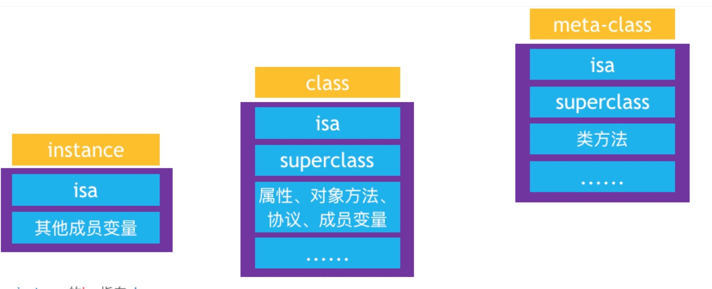
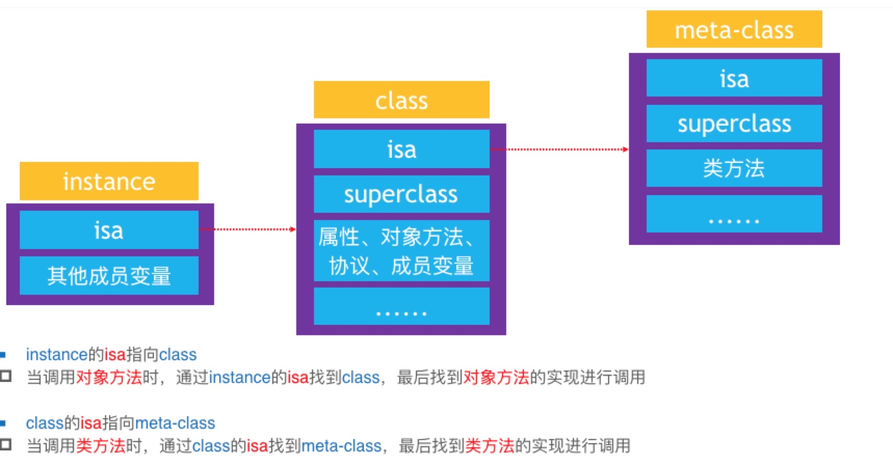
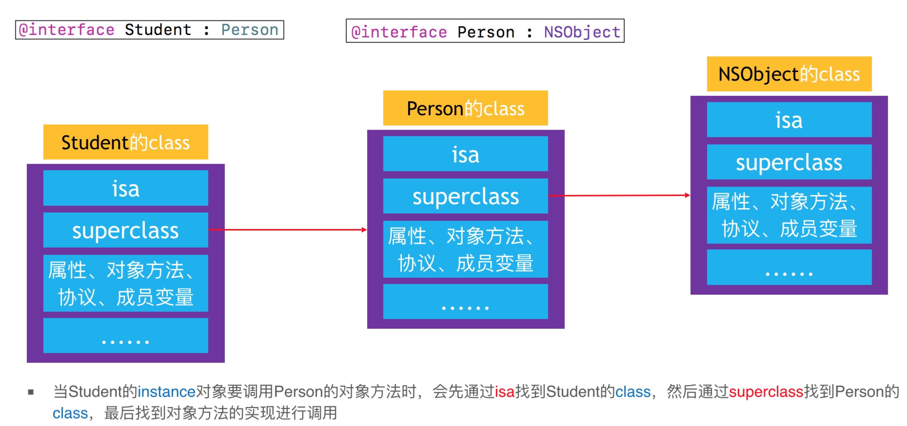

# Object-C底层学习
# 一、 Object-C的本质

* 我们平时写的Object-C代码，底层实现其实都是C\C++代码


* 所以Object-c的面向对象都是基于C\C++结构的实现的
* Object-C 的对象、类是基于C\C++的结构体实现的。

* 将Objective-C代码转换为C\C++代码

xcrun  -sdk  iphoneos  clang  -arch  arm64  -rewrite-objc  OC源文件  -o  输出的CPP文件
如果需要链接其他框架，使用-framework参数。比如-framework UIKit

## 一个对象的在内存中如何布局的？

NSObject的底层实现

在编译的cpp文件中，可以找到

```c
struct NSObject_IMPL {
    class isa;
};
```

这就是NSObject-C c++的实现，其中isa 是一个指针


在64位中，一个指针占据8个字节，因此我们得知，初始化一个NSObject对象的指针里面放的就是isa的地址


## 对象在内存分配

```objc
#import <Foundation/Foundation.h>
#import <malloc/malloc.h>
#import <objc/runtime.h>

struct NSObject_IMPL {
    Class isa;
};

struct MJPerson_IMPL {
    struct NSObject_IMPL NSObject_IVARS;
    int _age;
    int _height;
    int _no;
}; // 计算结构体大小，内存对齐，24

@interface MJPerson : NSObject
{
    int _age;
    int _height;
    int _no;
}
@end

@implementation MJPerson

@end

int main(int argc, const char * argv[]) {
    @autoreleasepool {
        MJPerson *p = [[MJPerson alloc] init];
        
        NSLog(@"%zd", sizeof(struct MJPerson_IMPL)); // 24
        
        NSLog(@"%zd %zd",
              class_getInstanceSize([MJPerson class]), // 24
              malloc_size((__bridge const void *)(p))); // 32
    }
    return 0;
}
```

上述代码中， MJPerson 编译中c++的结构体是MJPerson_IMPL，理论需要24个字节，虽然考虑了内存对齐，但是看malloc的源码我们知道，苹果为了优化，实际分配了32。


创建一个实例对象，至少需要多少内存？
 #import <objc/runtime.h>
class_getInstanceSize([NSObject class]);

创建一个实例对象，实际上分配了多少内存？
 #import <malloc/malloc.h>
malloc_size((__bridge const void *)obj);

# 二、isa和superclass等

## 1.OC对象的分类

**（1）ObJective- c中的对象，简称OC对象，主要可以分为以下3中**

* instance对象（实例对象）
* class对象（类对象）
* meta对象（元类对象）

**（2）举例：**

```objc
 //instance对象
Persion *person = [[Person alloc]init];
//class对象（类对象）
Class personClass = [Person class];
//meta对象（元类对象）
Class personMetaClass = object_getClass(personClass);
```

**（3）他们分别包含着一下信息：**



## 2.问对象的isa指向哪里?OC的类信息（那些属性方法，遵循协议，成员变量等）存放在哪里？

**（1）三个对象的联系**

调用一个实例的方法，但是实例本身有上述可以知道，本身是没有存储方法列表的，所以要找到类对象，同样调用类方法的的时候，也是没有存储的要找到元类对象，因此需要三者联系起来，通工isa联系起来。




**（2）superclass**

现在有student person 相关代码如下：

```objc
@interface Person : NSObject

- (void)eat;
- (void)sleep;

@end

@implementation Person

- (void)eat {
    NSLog(@"eat");
}

- (void)sleep {
    NSLog(@"sleep");
}

@end

@interface Student : Person

- (void)study;

@end

implementation  Student

- (void)study {
    NSLog(@"study");
}

@end

```

a.class的superclass

当student对象调用study的方法的时候，通过isa指针找到student的class 然后找到方法，当调用eat方法的时候isa找到student class,没有则通过student class superclass 找到person class 示意如下：



