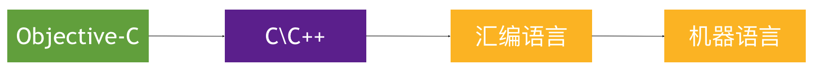
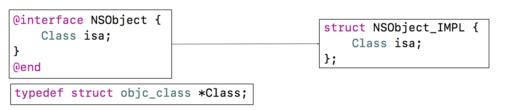
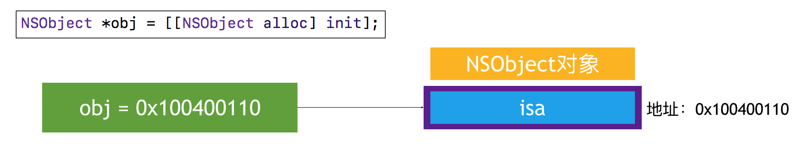

# Object-C的本质

* 我们平时写的Object-C代码，底层实现其实都是C\C++代码




* 所以Object-c的面向对象都是基于C\C++结构的实现的
* Object-C 的对象、类是基于C\C++的结构体实现的。

* 将Objective-C代码转换为C\C++代码

xcrun  -sdk  iphoneos  clang  -arch  arm64  -rewrite-objc  OC源文件  -o  输出的CPP文件
如果需要链接其他框架，使用-framework参数。比如-framework UIKit

## 一个对象的在内存中如何布局的？

NSObject的底层实现

在编译的cpp文件中，可以找到

```c
struct NSObject_IMPL {
    class isa;
};
```

这就是NSObject-C c++的实现，其中isa 是一个指针



在64位中，一个指针占据8个字节，因此我们得知，初始化一个NSObject对象的指针里面放的就是isa的地址



## 一个对象在内存中占多少个字节？


