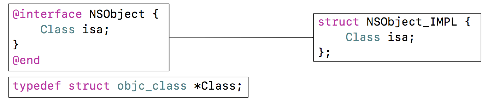
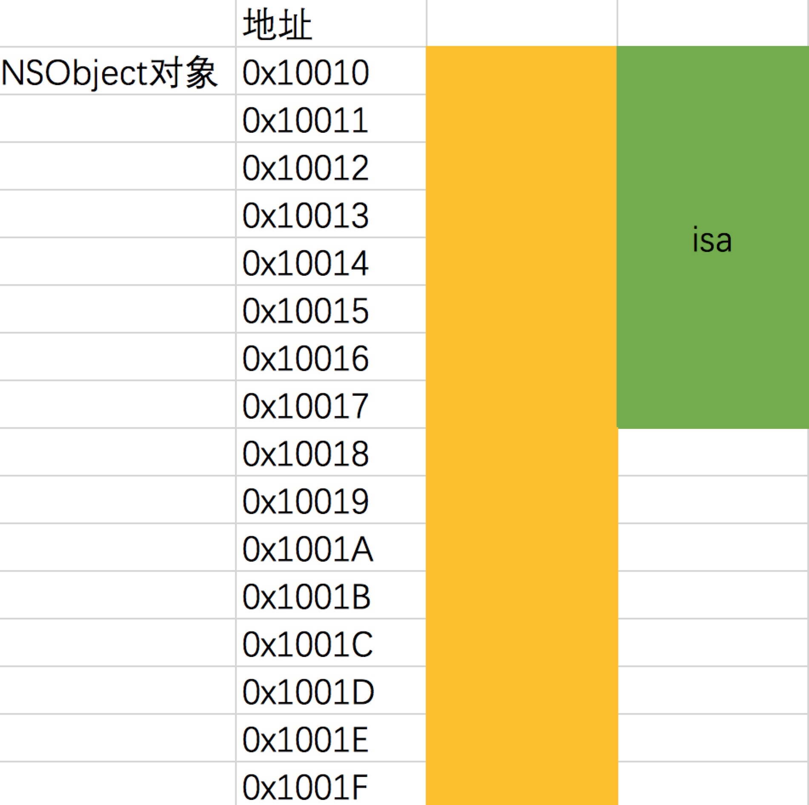
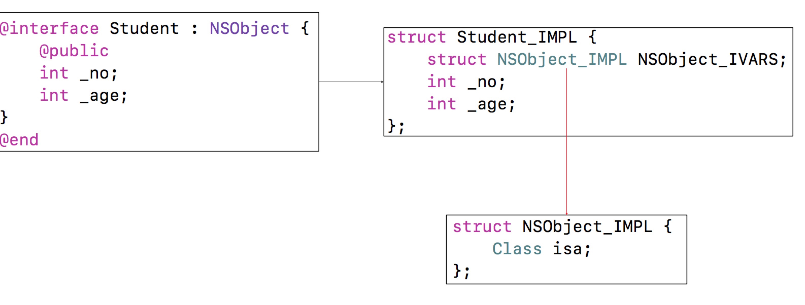
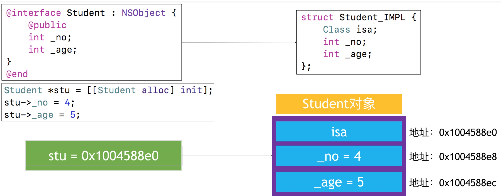
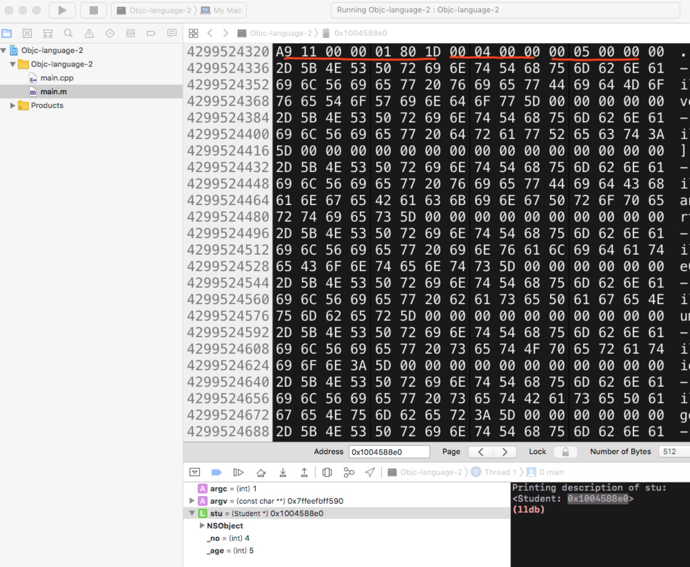

# Object-c 语法

## 一、Objective-C的本质

**目录**

* Objective-C 本质C\C++ 与验证 
* 内存布局
* 复杂的内存布局
* 相关面试题目

**1. Objective-C 本质C\C++ 与验证**

我们平时编写的Objective-C代码，底层实现其实都是C\C++代码


既然Objective-C的对象、类主要是基于C\C++，那么是基于C\C+数据结构实现的？

把Objective-C转换C++代码进行验证， 用下面的命令可以吧Objective-C转换为C\C++代码

```
xcrun  -sdk  iphoneos  clang  -arch  arm64  -rewrite-objc  OC源文件  -o  输出的CPP文
件
例子： xcrun -sdk iphoneos clang -arch arm64 -rewrite-objc main.m -o main.cpp
```

如果需要链接其他框架，使用-framework参数。比如-framework UIKit

下面代码翻译成C++

```objc
int main(int argc, const char * argv[]) {
    @autoreleasepool {
        NSObject *obj = [[NSObject alloc] init];
    }
    return 0;
}

```

在生成的main.cpp中，我们找到

```
struct NSObject_IMPL {
    Class isa;
};

```
NSObject 定义

```objec
@interface NSObject <NSObject> {
    Class isa;
}
```
因此，我们可以知道Objective-C的对象基于C++中的结构体实现的





**2. 内存布局**

NSObject的isa是一个指针，因此站8个字节，所以可知NSObject 是占8个字节的结构体，NSObject的地址就是isa的地址。

一个OC对象占用内存是多少？

runtime 中方法 class_getInstanceSize  malloc_size 可以获取类的大小

```objc
int main(int argc, const char * argv[]) {
    @autoreleasepool {
        NSObject *obj = [[NSObject alloc] init];
        
        // 获得NSObject实例对象的成员变量所占用的大小 >> 8
        NSLog(@"class_getInstanceSize----%zd", class_getInstanceSize([NSObject class]));
        
        // 获得obj指针所指向内存的大小 >> 16
        NSLog(@"%zd", malloc_size((__bridge const void *)obj));
    }
    return 0;
}
```

class_getInstanceSize 并不是返回的是实例对象的大小，我们可以在runtime的源码中，可以看到
返回的是成员变量的大小。

```
size_t class_getInstanceSize(Class cls)
{
    if (!cls) return 0;
    return cls->alignedInstanceSize();
}
// Class's ivar size rounded up to a pointer-size boundary.
uint32_t alignedInstanceSize() {
    return word_align(unalignedInstanceSize());
}   
```

内存示意图，实际分配了16个字节，用到了8个




**3.复杂的内存布局**

如下代码

```objc
@interface Student : NSObject {
    @public
    int _no;
    int _age;
}
@end

@implementation Student

@end

int main(int argc, const char * argv[]) {
    @autoreleasepool {
        Student *stu = [[Student alloc]init];
        stu->_no = 4;
        stu->_age = 5;

        NSLog(@"%zd", class_getInstanceSize([Student class]));
        NSLog(@"%zd", malloc_size((__bridge const void *)stu));
        
    }
    return 0;
}
```

编译的c++代码中，找到

```objc
struct NSObject_IMPL {
	Class isa;
};

struct Student_IMPL {
	struct NSObject_IMPL NSObject_IVARS;
	int _no;
	int _age;
};

可以看做
struct Student_IMPL {
    Class isa;
    int _no;
    int _age;
};
```






内存分布：



指针8个字节，int 4个字节，因此占16个字节


