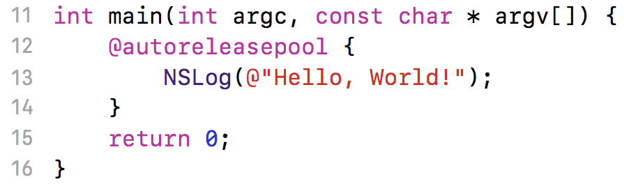
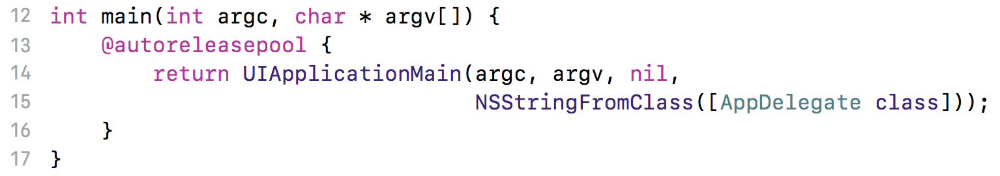
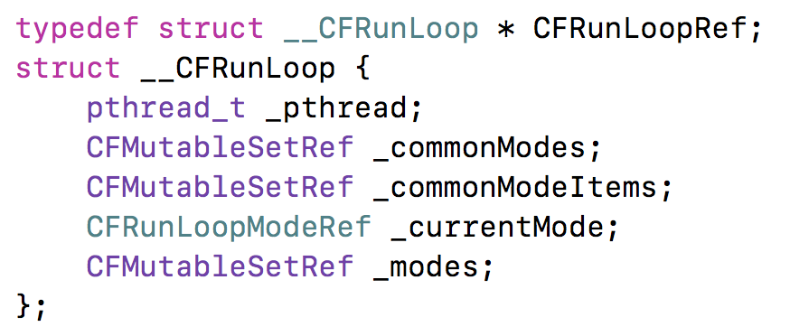
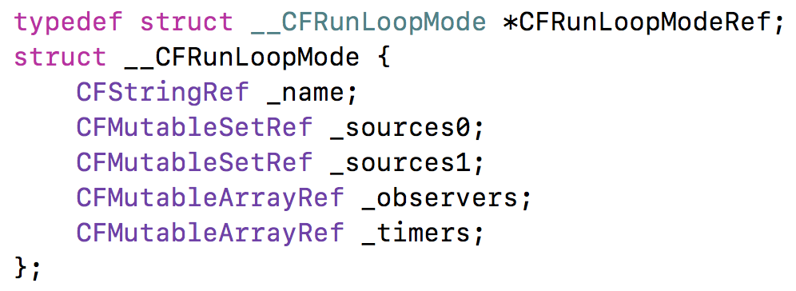
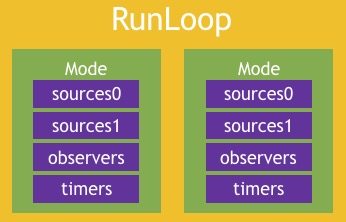
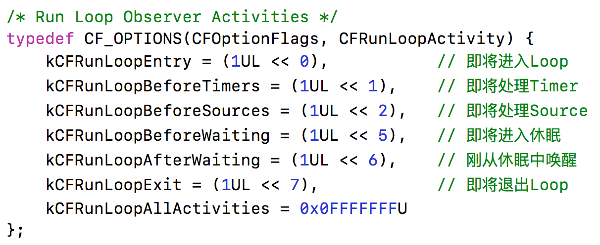
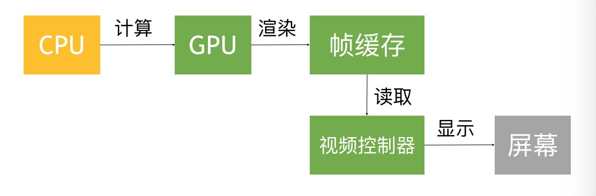
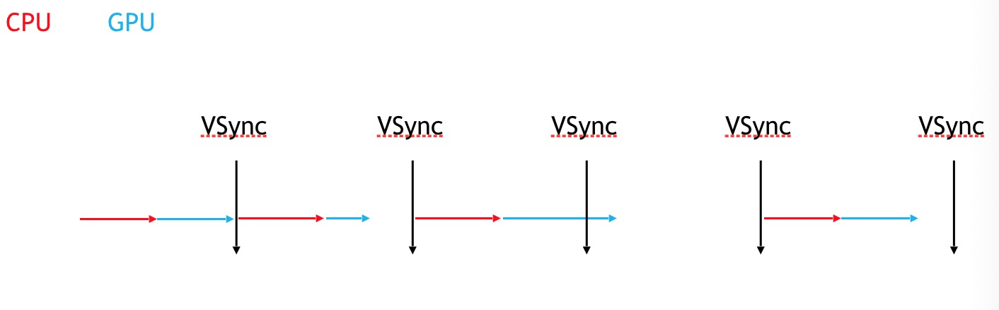
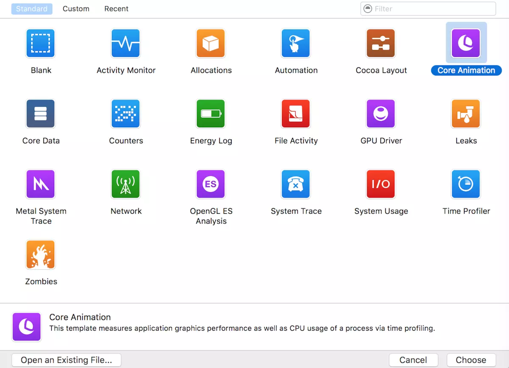
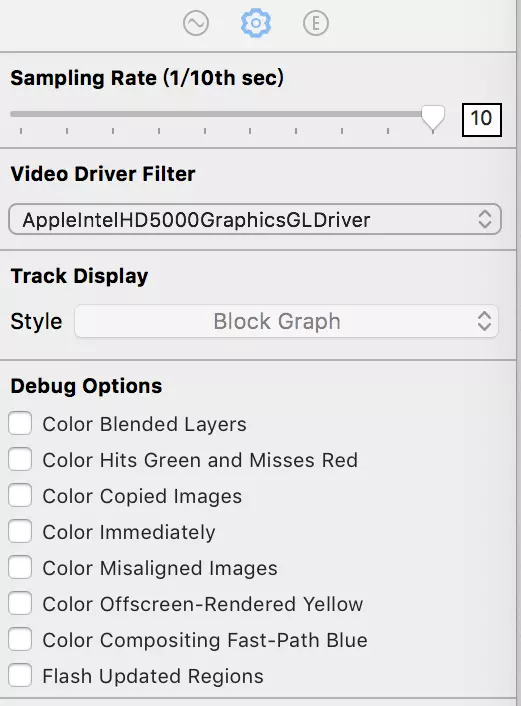

# runloop

## 一 问题

1. 讲讲 RunLoop，项目中有用到吗？

2. runloop内部实现逻辑？

3. runloop和线程的关系？

4. timer 与 runloop 的关系？

5.  程序中添加每3秒响应一次的NSTimer，当拖动tableview时timer可能无法响应要怎么解决？

6. runloop 是怎么响应用户操作的， 具体流程是什么样的？

7. 说说runLoop的几种状态

8. runloop的mode作用是什么？

## 二 什么是RunLoop

顾名思义 运行循环 在程序运行过程中循环做一些事情

### 1.应用范围**

定时器（Timer）、PerformSelector
GCD Async Main Queue、
事件响应、手势识别、界面刷新、
网络请求、AutoreleasePool


### 2.没有RunLoop**


执行完第13行代码后，会即将退出程序

### 3.有RunLoop**


程序并不会马上退出，而是保持运行状态

### 4.RunLoop的基本作用

* 保持程序的持续运行

* 处理App中的各种事件（比如触摸事件、定时器事件等）

* 节省CPU资源，提高程序性能：该做事时做事，该休息时休息

## 三 RunLoop对象

iOS中有2套API来访问和使用RunLoop

Foundation：NSRunLoop

Core Foundation：CFRunLoopRef

NSRunLoop和CFRunLoopRef都代表着RunLoop对象
NSRunLoop是基于CFRunLoopRef的一层OC包装


```objc
//Foundation
[NSRunLoop currentRunLoop]; // 获得当前线程的RunLoop对象
[NSRunLoop mainRunLoop]; // 获得主线程的RunLoop对象

//Core Foundation
CFRunLoopGetCurrent(); // 获得当前线程的RunLoop对象
CFRunLoopGetMain(); // 获得主线程的RunLoop对象
```

## 三 RunLoop与线程

* 每条线程都有唯一的一个与之对应的RunLoop对象

* RunLoop保存在一个全局的Dictionary里，线程作为key，RunLoop作为value

* 线程刚创建时并没有RunLoop对象，RunLoop会在第一次获取它时创建

* RunLoop会在线程结束时销毁

* 主线程的RunLoop已经自动获取（创建），子线程默认没有开启RunLoop

## 三 RunLoop相关的类

### 1.Core Foundation中关于RunLoop的5个类

```objc
      
CFRunLoopModeRef
CFRunLoopSourceRef
CFRunLoopTimerRef
CFRunLoopObserverRef
```

CFRunLoopRef


CFRunLoopModelRef



总体



### 2.CFRunLoopModeRef

* CFRunLoopModeRef代表RunLoop的运行模式

* 一个RunLoop包含若干个Mode，每个Mode又包含若干个Source0/Source1/Timer/Observer

* RunLoop启动时只能选择其中一个Mode，作为currentMode

* 如果需要切换Mode，只能退出当前Loop，再重新选择一个Mode进入
不同组的Source0/Source1/Timer/Observer能分隔开来，互不影响

* 如果Mode里没有任何Source0/Source1/Timer/Observer，RunLoop会立马退出

### 3. 两种常见的model

* kCFRunLoopDefaultMode（NSDefaultRunLoopMode）：App的默认Mode，通常主线程是在这个Mode下运行

* UITrackingRunLoopMode：界面跟踪 Mode，用于 ScrollView 追踪触摸滑动，保证界面滑动时不受其他 Mode 影响

```objc
 // 创建Observer
    CFRunLoopObserverRef observer = CFRunLoopObserverCreateWithHandler(kCFAllocatorDefault, kCFRunLoopAllActivities, YES, 0, ^(CFRunLoopObserverRef observer, CFRunLoopActivity activity) {
        switch (activity) {
            case kCFRunLoopEntry: {
                CFRunLoopMode mode = CFRunLoopCopyCurrentMode(CFRunLoopGetCurrent());
                NSLog(@"kCFRunLoopEntry - %@", mode);
                CFRelease(mode);
                break;
            }
                
            case kCFRunLoopExit: {
                CFRunLoopMode mode = CFRunLoopCopyCurrentMode(CFRunLoopGetCurrent());
                NSLog(@"kCFRunLoopExit - %@", mode);
                CFRelease(mode);
                break;
            }
                
            default:
                break;
        }
    });
 // 添加Observer到RunLoop中
    CFRunLoopAddObserver(CFRunLoopGetMain(), observer, kCFRunLoopCommonModes);
    // 释放
    CFRelease(observer);

```


### 4. CFRunLoopObserverRef




```objc
void observeRunLoopActicities(CFRunLoopObserverRef observer, CFRunLoopActivity activity, void *info)
{
    switch (activity) {
        case kCFRunLoopEntry:
            NSLog(@"kCFRunLoopEntry");
            break;
        case kCFRunLoopBeforeTimers:
            NSLog(@"kCFRunLoopBeforeTimers");
            break;
        case kCFRunLoopBeforeSources:
            NSLog(@"kCFRunLoopBeforeSources");
            break;
        case kCFRunLoopBeforeWaiting:
            NSLog(@"kCFRunLoopBeforeWaiting");
            break;
        case kCFRunLoopAfterWaiting:
            NSLog(@"kCFRunLoopAfterWaiting");
            break;
        case kCFRunLoopExit:
            NSLog(@"kCFRunLoopExit");
            break;
        default:
            break;
    }
}

//创建Observer
CFRunLoopObserverRef observer = CFRunLoopObserverCreate(kCFAllocatorDefault, kCFRunLoopAllActivities, YES, 0, observeRunLoopActicities, NULL);
// 添加Observer到RunLoop中
CFRunLoopAddObserver(CFRunLoopGetMain(), observer, kCFRunLoopCommonModes);
// 释放
CFRelease(observer);
```

## 四 RunLoop的运行逻辑

* Source0
触摸事件处理
performSelector:onThread:

* Source1
基于Port的线程间通信
系统事件捕捉

* Timers
NSTimer
performSelector:withObject:afterDelay:

* Observers
用于监听RunLoop的状态
UI刷新（BeforeWaiting）
Autorelease pool（BeforeWaiting）

01、通知Observers：进入Loop

02、通知Observers：即将处理Timers

03、通知Observers：即将处理Sources

04、处理Blocks

05、处理Source0（可能会再次处理Blocks）

06、如果存在Source1，就跳转到第8步

07、通知Observers：开始休眠（等待消息唤醒）

08、通知Observers：结束休眠（被某个消息唤醒）

01> 处理Timer

02> 处理GCD Async To Main Queue

03> 处理Source1

09、处理Blocks

10、根据前面的执行结果，决定如何操作

01> 回到第02步

02> 退出Loop

11、通知Observers：退出Loop


## 五 线程保活

```objc
#import <Foundation/Foundation.h>

typedef void (^MJPermenantThreadTask)(void);

@interface MJPermenantThread : NSObject

/**
 开启线程
 */
//- (void)run;

/**
 在当前子线程执行一个任务
 */
- (void)executeTask:(MJPermenantThreadTask)task;

/**
 结束线程
 */
- (void)stop;

@end

#import "MJPermenantThread.h"

/** MJThread **/
@interface MJThread : NSThread
@end
@implementation MJThread
- (void)dealloc
{
    NSLog(@"%s", __func__);
}
@end

/** MJPermenantThread **/
@interface MJPermenantThread()
@property (strong, nonatomic) MJThread *innerThread;
@property (assign, nonatomic, getter=isStopped) BOOL stopped;
@end

@implementation MJPermenantThread
#pragma mark - public methods
- (instancetype)init
{
    if (self = [super init]) {
        self.stopped = NO;
        
        __weak typeof(self) weakSelf = self;
        
        self.innerThread = [[MJThread alloc] initWithBlock:^{
            [[NSRunLoop currentRunLoop] addPort:[[NSPort alloc] init] forMode:NSDefaultRunLoopMode];
            
            while (weakSelf && !weakSelf.isStopped) {
                [[NSRunLoop currentRunLoop] runMode:NSDefaultRunLoopMode beforeDate:[NSDate distantFuture]];
            }
        }];
        
        [self.innerThread start];
    }
    return self;
}

//- (void)run
//{
//    if (!self.innerThread) return;
//
//    [self.innerThread start];
//}

- (void)executeTask:(MJPermenantThreadTask)task
{
    if (!self.innerThread || !task) return;
    
    [self performSelector:@selector(__executeTask:) onThread:self.innerThread withObject:task waitUntilDone:NO];
}

- (void)stop
{
    if (!self.innerThread) return;
    
    [self performSelector:@selector(__stop) onThread:self.innerThread withObject:nil waitUntilDone:YES];
}

- (void)dealloc
{
    NSLog(@"%s", __func__);
    
    [self stop];
}

#pragma mark - private methods
- (void)__stop
{
    self.stopped = YES;
    CFRunLoopStop(CFRunLoopGetCurrent());
    self.innerThread = nil;
}

- (void)__executeTask:(MJPermenantThreadTask)task
{
    task();
}

@end

```


## 六 卡顿处理

### 1 CPU  GPU 

在屏幕成像的过程中，CPU和GPU起着至关重要的作用
CPU（Central Processing Unit，中央处理器）
对象的创建和销毁、对象属性的调整、布局计算、文本的计算和排版、图片的格式转换和解码、图像的绘制（Core Graphics）

GPU（Graphics Processing Unit，图形处理器）
纹理的渲染




在iOS中是双缓冲机制，有前帧缓存、后帧缓存

### 2.卡顿产生的原因



尽可能减少CPU、GPU资源消耗

按照60FPS的刷帧率，每隔16ms就会有一次VSync信号

### 3. 卡顿优化 - CPU

* 尽量用轻量级的对象，比如用不到事件处理的地方，可以考虑使用CALayer取代UIView

* 不要频繁地调用UIView的相关属性，比如frame、bounds、transform等属性，尽量减少不必要的修改

* 尽量提前计算好布局，在有需要时一次性调整对应的属性，不要多次修改属性

* Autolayout会比直接设置frame消耗更多的CPU资源

* 图片的size最好刚好跟UIImageView的size保持一致

* 控制一下线程的最大并发数量

* 尽量把耗时的操作放到子线程
文本处理（尺寸计算、绘制）
图片处理（解码、绘制）

### 4. 卡顿优化 - GPU

* 尽量避免短时间内大量图片的显示，尽可能将多张图片合成一张进行显示

* GPU能处理的最大纹理尺寸是4096x4096，一旦超过这个尺寸，就会占用CPU资源进行处理，所以纹理尽量不要超过这个尺寸

* 尽量减少视图数量和层次

* 减少透明的视图（alpha<1），不透明的就设置opaque为YES

* 尽量避免出现离屏渲染

### 5. 离屏渲染


**GPU屏幕渲染有两种方式:**

（1）On-Screen Rendering (当前屏幕渲染) 

指的是GPU的渲染操作是在当前用于显示的屏幕缓冲区进行。

（2）Off-Screen Rendering (离屏渲染)

指的是在GPU在当前屏幕缓冲区以外开辟一个缓冲区进行渲染操作。

当前屏幕渲染不需要额外创建新的缓存，也不需要开启新的上下文，相对于离屏渲染性能更好。但是受当前屏幕渲染的局限因素限制(只有自身上下文、屏幕缓存有限等)，当前屏幕渲染有些情况下的渲染解决不了的，就使用到离屏渲染。

相比于当前屏幕渲染，离屏渲染的代价是很高的，主要体现在两个方面：

（1）创建新缓冲区

要想进行离屏渲染，首先要创建一个新的缓冲区。

（2）上下文切换

离屏渲染的整个过程，需要多次切换上下文环境：先是从当前屏幕（On-Screen）切换到离屏（Off-Screen），等到离屏渲染结束以后，将离屏缓冲区的渲染结果显示到屏幕上有需要将上下文环境从离屏切换到当前屏幕。而上下文环境的切换是要付出很大代价的。

由于垂直同步的机制，如果在一个 HSync 时间内，CPU 或者 GPU 没有完成内容提交，则那一帧就会被丢弃，等待下一次机会再显示，而这时显示屏会保留之前的内容不变。这就是界面卡顿的原因。

**既然离屏渲染这么耗性能,为什么有这套机制呢?**

有些效果被认为不能直接呈现于屏幕，而需要在别的地方做额外的处理预合成。图层属性的混合体没有预合成之前不能直接在屏幕中绘制，所以就需要屏幕外渲染。屏幕外渲染并不意味着软件绘制，但是它意味着图层必须在被显示之前在一个屏幕外上下文中被渲染（不论CPU还是GPU）。

**下面的情况或操作会引发离屏渲染：**

- 为图层设置遮罩（layer.mask）

- 将图层的layer.masksToBounds / view.clipsToBounds属性设置为true

- 将图层layer.allowsGroupOpacity属性设置为YES和layer.opacity小于1.0

- 为图层设置阴影（layer.shadow *）。

- 为图层设置layer.shouldRasterize=true

- 具有layer.cornerRadius，layer.edgeAntialiasingMask，layer.allowsEdgeAntialiasing的图层

- 文本（任何种类，包括UILabel，CATextLayer，Core Text等）。

- 使用CGContext在drawRect :方法中绘制大部分情况下会导致离屏渲染，甚至仅仅是一个空的实现。

**优化方案**

官方对离屏渲染产生性能问题也进行了优化：

iOS 9.0 之前UIimageView跟UIButton设置圆角都会触发离屏渲染。

iOS 9.0 之后UIButton设置圆角会触发离屏渲染，而UIImageView里png图片设置圆角不会触发离屏渲染了，如果设置其他阴影效果之类的还是会触发离屏渲染的。


1、圆角优化

在APP开发中，圆角图片还是经常出现的。如果一个界面中只有少量圆角图片或许对性能没有非常大的影响，但是当圆角图片比较多的时候就会APP性能产生明显的影响。

我们设置圆角一般通过如下方式：

```objc
imageView.layer.cornerRadius = CGFloat(10);
imageView.layer.masksToBounds = YES;
```


这样处理的渲染机制是GPU在当前屏幕缓冲区外新开辟一个渲染缓冲区进行工作，也就是离屏渲染，这会给我们带来额外的性能损耗，如果这样的圆角操作达到一定数量，会触发缓冲区的频繁合并和上下文的的频繁切换，性能的代价会宏观地表现在用户体验上——掉帧。

优化方案1：使用贝塞尔曲线UIBezierPath和Core Graphics框架画出一个圆角

```objc
UIImageView *imageView = [[UIImageView alloc] initWithFrame:CGRectMake(100,100,100,100)];

imageView.image = [UIImage imageNamed:@"myImg"];

//开始对imageView进行画图

UIGraphicsBeginImageContextWithOptions(imageView.bounds.size,NO,1.0);

//使用贝塞尔曲线画出一个圆形图

[[UIBezierPath bezierPathWithRoundedRect:imageView.boundscornerRadius:imageView.frame.size.width]addClip];

[imageView drawRect:imageView.bounds];

imageView.image=UIGraphicsGetImageFromCurrentImageContext();

//结束画图

UIGraphicsEndImageContext();

[self.view addSubview:imageView];
```


优化方案2：使用CAShapeLayer和UIBezierPath设置圆角


```objc
UIImageView *imageView = [[UIImageView alloc]initWithFrame:CGRectMake(100, 100, 100, 100)];

imageView.image = [UIImage imageNamed:@"myImg"];

UIBezierPath *maskPath = [UIBezierPath bezierPathWithRoundedRect:imageView.bounds byRoundingCorners:UIRectCornerAllCorners cornerRadii:imageView.bounds.size];

CAShapeLayer *maskLayer = [[CAShapeLayer alloc]init];

//设置大小

maskLayer.frame = imageView.bounds;

//设置图形样子

maskLayer.path = maskPath.CGPath;

imageView.layer.mask = maskLayer;

[self.view addSubview:imageView];
```


对于方案2需要解释的是：

CAShapeLayer继承于CALayer,可以使用CALayer的所有属性值；

CAShapeLayer需要贝塞尔曲线配合使用才有意义（也就是说才有效果）

使用CAShapeLayer(属于CoreAnimation)与贝塞尔曲线可以实现不在view的drawRect（继承于CoreGraphics走的是CPU,消耗的性能较大）方法中画出一些想要的图形

CAShapeLayer动画渲染直接提交到手机的GPU当中，相较于view的drawRect方法使用CPU渲染而言，其效率极高，能大大优化内存使用情况。


总的来说就是用CAShapeLayer的内存消耗少，渲染速度快，建议使用优化方案2。


2、shadow优化

对于shadow，如果图层是个简单的几何图形或者圆角图形，我们可以通过设置shadowPath来优化性能，能大幅提高性能。示例如下：


```objc
imageView.layer.shadowColor=[UIColorgrayColor].CGColor;

imageView.layer.shadowOpacity=1.0;

imageView.layer.shadowRadius=2.0;

UIBezierPath *path=[UIBezierPathbezierPathWithRect:imageView.frame];

imageView.layer.shadowPath=path.CGPath;
```

我们还可以通过设置shouldRasterize属性值为YES来强制开启离屏渲染。其实就是光栅化（Rasterization）。既然离屏渲染这么不好，为什么我们还要强制开启呢？当一个图像混合了多个图层，每次移动时，每一帧都要重新合成这些图层，十分消耗性能。当我们开启光栅化后，会在首次产生一个位图缓存，当再次使用时候就会复用这个缓存。但是如果图层发生改变的时候就会重新产生位图缓存。所以这个功能一般不能用于UITableViewCell中，cell的复用反而降低了性能。最好用于图层较多的静态内容的图形。而且产生的位图缓存的大小是有限制的，一般是2.5个屏幕尺寸。在100ms之内不使用这个缓存，缓存也会被删除。所以我们要根据使用场景而定。


3、其他的一些优化建议

* 当我们需要圆角效果时，可以使用一张中间透明图片蒙上去

* 使用ShadowPath指定layer阴影效果路径

* 使用异步进行layer渲染（Facebook开源的异步绘制框架AsyncDisplayKit）

* 设置layer的opaque值为YES，减少复杂图层合成

* 尽量使用不包含透明（alpha）通道的图片资源

* 尽量设置layer的大小值为整形值

* 直接让美工把图片切成圆角进行显示，这是效率最高的一种方案

* 很多情况下用户上传图片进行显示，可以让服务端处理圆角

* 使用代码手动生成圆角Image设置到要显示的View上，利用UIBezierPath（CoreGraphics框架）画出来圆角图片


### 6. 卡顿优化工具


**1.官方**




* Color Blended Layers：这个选项如果勾选，你能看到哪个layer是透明的，GPU正在做混合计算。显示红色的就是透明的，绿色就是不透明的。

* Color Hits Green and Misses Red：如果勾选这个选项，且当我们代码中有设置shouldRasterize为YES，那么红色代表没有复用离屏渲染的缓存，绿色则表示复用了缓存。我们当然希望能够复用。

* Color Immediately：默认情况下Core Animation工具以每毫秒10次的频率更新图层调试颜色，如果勾选这个选项则移除10ms的延迟。对某些情况需要这样，但是有可能影响正常帧数的测试。

* Color Misaligned Images：勾选此项，如果图片需要缩放则标记为黄色，如果没有像素对齐则标记为紫色。像素对齐我们已经在上面有所介绍。

* Color Offscreen-Rendered Yellow：用来检测离屏渲染的，如果显示黄色，表示有离屏渲染。当然还要结合Color Hits Green and Misses Red来看，是否复用了缓存。

* Color OpenGL Fast Path Blue：这个选项对那些使用OpenGL的图层才有用，像是GLKView或者 CAEAGLLayer，如果不显示蓝色则表示使用了CPU渲染，绘制在了屏幕外，显示蓝色表示正常。

* Flash Updated Regions：当对图层重绘的时候回显示黄色，如果频繁发生则会影响性能。可以用增加缓存来增强性能。


**2.卡顿检测工具**


**3.页面提示工具**


