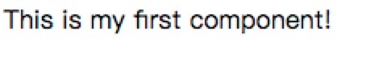
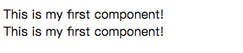
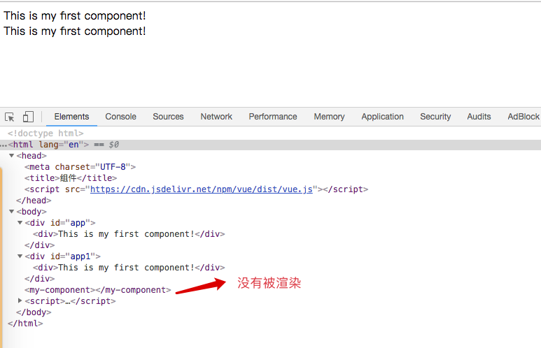
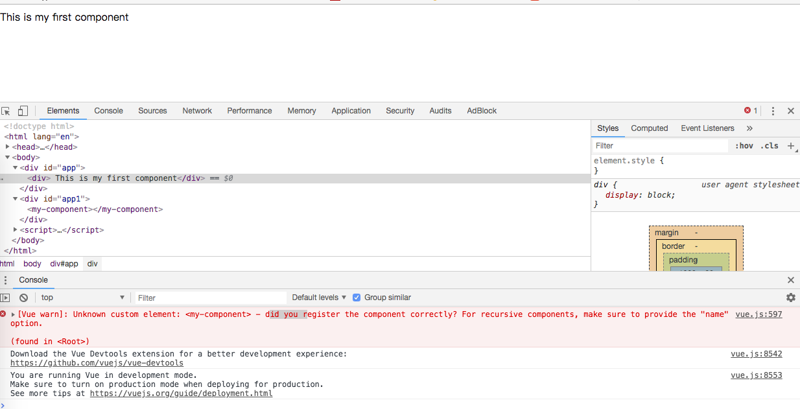
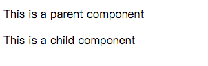
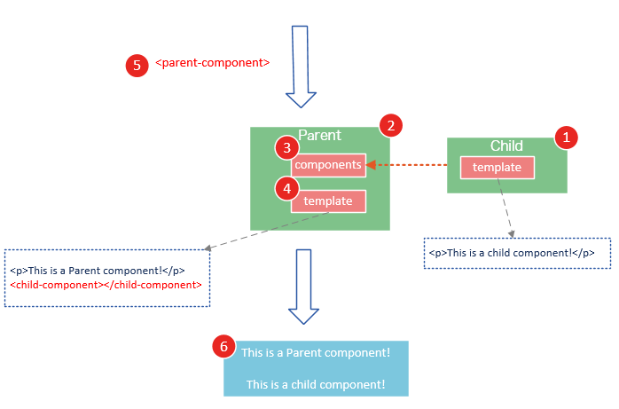

## 一、 什么是组件


```js
<!DOCTYPE html>
<html lang="en">
<head>
    <meta charset="UTF-8">
    <title>组件</title>
    <script src="https://cdn.jsdelivr.net/npm/vue/dist/vue.js"></script>
</head>
<body>

<div id="coponents-demo">
    <button-counter></button-counter>
</div>

<script>

    Vue.component('button-counter',{
        data:function () {
            return {
                count:0
            }
        },
        template:'<button v-on:click="count++">You clicked me {{count}} times</button>'
    })

    new Vue({
        el:'#coponents-demo'
    })

</script>

</body>
</html>
```

**组件复用**

```js
<div id="components-demo">
  <button-counter></button-counter>
  <button-counter></button-counter>
  <button-counter></button-counter>
</div>
```
 注意当点击按钮时，每个组件都会各自独立维护它的 count。因为你每用一次组件，就会有一个它的新实例被创建。
 
**data必须是个函数**

当我们定义这个 <button-counter> 组件时，你可能会发现它的 data 并不是像这样直接提供一个对象：

```js
data: {
  count: 0
}
```
取而代之的是，一个组件的 data 选项必须是一个函数，因此每个实例可以维护一份被返回对象的独立的拷贝：

```js
data: function () {
  return {
    count: 0
  }
}
```
如果 Vue 没有这条规则，点击一个按钮就可能会像如下代码一样影响到其它所有实例：

## 二、组件的创建和注册

**基本步骤**

1 调用Vue.extend()方法创建组件构造器
2 调用Vue.component()方法注册组件
3 在Vue 实例的作用范围内使用组件

实例代码

```js
<!DOCTYPE html>
<html lang="en">
<head>
    <meta charset="UTF-8">
    <title>组件</title>
    <script src="https://cdn.jsdelivr.net/npm/vue/dist/vue.js"></script>
</head>
<body>

<div id="app">

    <!--3.#app是Vue挂载实例的元素，应该在元素范围内使用组件-->
    <my-component></my-component>
</div>

<script>

    //1.创建组件构造器
    var myComponent = Vue.extend({
        template:'<div>This is my first component!</div>'
    })

    //2.注册组件，并指定组件的标签，组件的HTML标签为<my-component>
    Vue.component('my-component', myComponent)

    new Vue({
        el:'#app'
    })

</script>

</body>
</html>
```

运行结果：


**理解组件的创建和注册**

我们用以下几个步骤来理解组件的创建和注册：

1.Vue.extend()是创建Vue构造器的扩展，调用Vue.extend()创建一个组件构造器，而不死一个具体的组件实例。
2. Vue.extend()构造器有一个选项对象，选项对象的template属性用于定义组件要渲染的HTML
3. 使用Vue.component注册组件时，需要提供2个参数，第一个参数是组件的标签，第2个参数是组件构造器。
4. Vue.component()方法内部会调用组件构造器，创建一个组件实例。
5. 组件应该挂载到某个Vue实例下，否则不会生效。

请注意第5点，以下代码在3个地方使用了<my-component>标签，但只有#app1和#app2下的<my-component>标签才起到作用。

```js
<!DOCTYPE html>
<html lang="en">
<head>
    <meta charset="UTF-8">
    <title>组件</title>
    <script src="https://cdn.jsdelivr.net/npm/vue/dist/vue.js"></script>
</head>
<body>

<div id="app">

    <!--3.#app是Vue挂载实例的元素，应该在元素范围内使用组件-->
    <my-component></my-component>
</div>

<div id="app1">
    <my-component></my-component>
</div>

<my-component></my-component>


<script>


    //1.创建组件构造器
    var myComponent = Vue.extend({
        template:'<div>This is my first component!</div>'
    })

    //2.注册组件，并指定组件的标签，组件的HTML标签为<my-component>
    Vue.component('my-component', myComponent)

    var app = new Vue({
        el:'#app'
    })

    var app1 = new Vue({
        el:'#app1'
    })


</script>

</body>
</html>
```





**全局注册和局部注册**

调用Vue.component()注册组件时，组件的注册是全局的，这意味着该组件可以在任意Vue示例下使用。
如果不需要全局注册，或者是让组件使用在其它组件内，可以用选项对象的components属性实现局部注册。

```js
<!DOCTYPE html>
<html lang="en">
<head>
    <meta charset="UTF-8">
    <title>组件注册</title>
    <script src="https://cdn.jsdelivr.net/npm/vue/dist/vue.js"></script>
</head>
<body>

<div id="app">
    <my-component></my-component>
</div>

<div id="app1">
    <!--不能使用，my-component是局部组件属于#app-->
    <my-component></my-component>
</div>


<script>
    //创建一个组件构造器
    var myComponent = Vue.extend({
        template: '<div> This is my first component</div>'
    })

    new Vue({
        el: '#app',
        components: {
            'my-component': myComponent
        }
    })

    new Vue({
        el:'#app1'
    })

</script>
</body>
</html>
```

如果这样使用，浏览器提示错误



##父组件和子组件
我们可以在组件中定义并使用其他组件，这就构成了父子组件的关系。

```js
<!DOCTYPE html>
<html lang="en">
<head>
    <meta charset="UTF-8">
    <title>父子组件</title>
    <script src="https://cdn.jsdelivr.net/npm/vue/dist/vue.js"></script>
</head>
<body>

<div id="app">
    <parent-component>
    </parent-component>
</div>

<script>
    var child = Vue.extend({
        template: '<p> This is a child component</p>'
    })

    var parent = Vue.extend({
        //在parent组件内使用<child-component>标签
        template: '<p> This is a parent component<child-component></child-component></p>',
        components: {
            //局部注册chilid组件，该组件只能在parent组件中使用
            'child-component': child
        }
    })

    //全局注册parent组件
    Vue.component('parent-component', parent)

    new Vue({
        el: '#app'
    })
</script>

</body>
</html>
```



几个步骤来理解这段代码：

1. var Child = Vue.extend(...)定义一了个Child组件构造器
2. var Parent = Vue.extend(...)定义一个Parent组件构造器
3. components: { 'child-component': Child }，将Child组件注册到Parent组件，并将Child组件的标签设置为child-component。
4. template :'<p>This is a Parent component</p><child-component></child-component>'，在Parent组件内以标签的形式使用Child组件。
5. Vue.component('parent-component', Parent) 全局注册Parent组件
6. 在页面中使用<parent-component>标签渲染Parent组件的内容，同时Child组件的内容也被渲染出来



Child组件是在Parent组件中注册的，它只能在Parent组件中使用，确切地说：**子组件只能在父组件的template中使用。**


